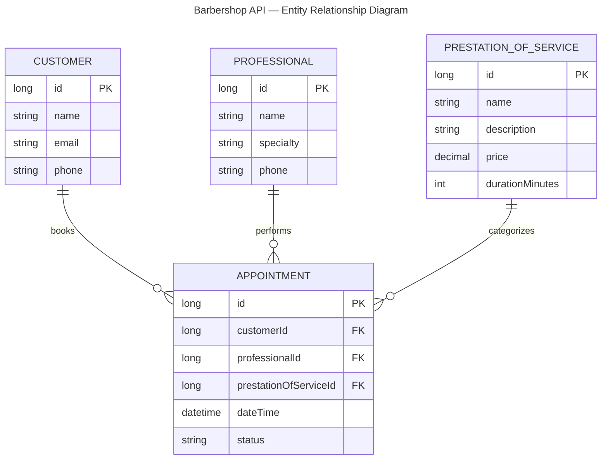

# Entity Relationship Diagram

> Barbershop Scheduling API — Phase 1 (MVC + ASP.NET)

## Entities

| Entity | Description |
|--------|-------------|
| **Customer** | End user who books appointments at the barbershop |
| **Professional** | Barber or stylist who performs the service |
| **PrestationOfService** | Type of service offered (e.g. Haircut, Beard, Haircut + Beard combo) — each combination is its own type with independent pricing and duration |
| **Appointment** | A scheduled booking tying a customer, a professional, and a prestation of service together at a specific date/time |

## Relationships

| Relationship | Cardinality | Description |
|-------------|-------------|-------------|
| Customer → Appointment | One-to-Many | A customer can book multiple appointments |
| Professional → Appointment | One-to-Many | A professional can perform multiple appointments |
| PrestationOfService → Appointment | One-to-Many | A prestation of service can be associated with multiple appointments |

## Status Values

The `status` field on `Appointment` supports the following values:

| Status | Description |
|--------|-------------|
| `Scheduled` | Appointment is booked and confirmed |
| `Completed` | Service was performed |
| `Cancelled` | Appointment was cancelled by customer or professional |
| `NoShow` | Customer did not show up |
